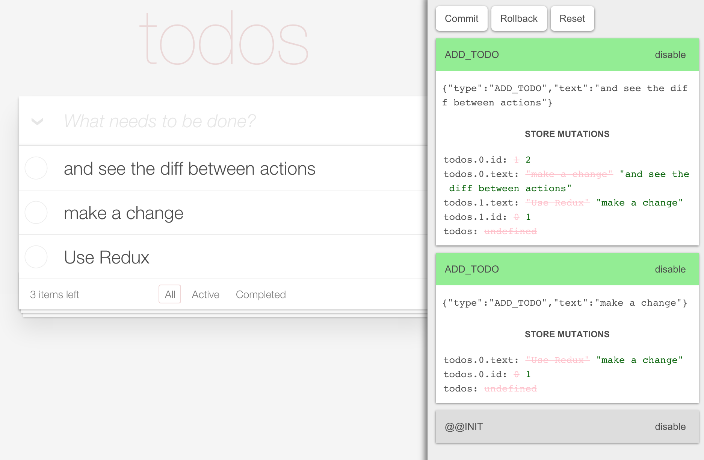

# react 前端项目技术选型、开发工具、周边生态

> 声明：这不是一篇介绍 React 基础知识的文章，需要熟悉 React 相关知识

- 主架构：[react](https://github.com/facebook/react), [react-router](https://github.com/ReactTraining/react-router), [redux](https://github.com/reduxjs/redux), [redux-thunk](https://github.com/reduxjs/redux-thunk), [redux-saga](https://github.com/redux-saga/redux-saga), [react-redux](https://github.com/reduxjs/react-redux), [dva](https://github.com/dvajs/dva), [umi](https://github.com/umijs/umi)

- 扩展架构：[styled-components](https://github.com/styled-components/styled-components), [recompose](https://github.com/acdlite/recompose), [react-loadable](https://github.com/jamiebuilds/react-loadable)

- UI 框架：[ant-design](https://github.com/ant-design/ant-design), [ant-design-mobile](https://github.com/ant-design/ant-design-mobile), [material-ui](https://github.com/mui-org/material-ui), [Semantic-UI-React](https://github.com/Semantic-Org/Semantic-UI-React), [blueprint](https://github.com/palantir/blueprint), [react-bootstrap](https://github.com/react-bootstrap/react-bootstrap)

- 服务器端渲染：[next.js](https://github.com/zeit/next.js), [razzle](https://github.com/jaredpalmer/razzle), [react-server](https://github.com/redfin/react-server), [beidou](https://github.com/alibaba/beidou)

- 开发工具：[storybook](https://github.com/storybooks/storybook), [react-devtools](https://github.com/facebook/react-devtools), [redux-devtools](https://github.com/reduxjs/redux-devtools), [redux-devtools-extension](https://github.com/zalmoxisus/redux-devtools-extension)

- 测试：[enzyme](https://github.com/airbnb/enzyme), [react-testing-library](https://github.com/kentcdodds/react-testing-library), [jest](https://github.com/facebook/jest)

- 替代库：[preact](https://github.com/developit/preact), [inferno](https://github.com/infernojs/inferno)

- 插件库：[react-motion](https://github.com/chenglou/react-motion), [react-select](https://github.com/JedWatson/react-select), [reselect](https://github.com/reduxjs/reselect), [react-beautiful-dnd](https://github.com/atlassian/react-beautiful-dnd), [react-canvas](https://github.com/Flipboard/react-canvas), [redux-form](https://github.com/erikras/redux-form), [recharts](https://github.com/recharts/recharts), [react-dnd](https://github.com/react-dnd/react-dnd), [react-helmet](https://github.com/nfl/react-helmet)

## 1. 架构选型演进

1. 如果页面比较简单，可以只用 `react`
2. 如果需要本地路由功能，比如在单页面应用（SPA）中维持多个页面，并且可以本地控制路由跳转逻辑，这时就需要搭配使用 `react-router`
3. 一般稍复杂的页面都会遇到一些问题：组件之间的通信问题（比如 A 组件想要改变 B 组件的 `state`）、跨组件数据储存与共享问题（比如多页面购物车数据存储）。`react` 本身并不能很好的解决这个问题，需要搭配使用 `redux`
4. `redux` 本身只实现了 [flux](https://github.com/facebook/flux) 理念，以及一些基础的功能，但在使用中，还需要扩展一些功能，比如异步派发 `action`，这时可以选择搭配使用 `redux-thunk` 来解决异步派发 `action` 的问题。另外，也是选择 `redux-saga`，但 `redux-saga` 不仅仅是异步派发 `action`，它拥有强大的异步数据流处理功能，几乎改变了整个 `redux` 的使用方式，是个重量级的家伙，如果是庞大且复杂的项目，推荐使用 `redux-saga`
5. `redux` 本身并不与 `react` 绑定，你依然可以把 `redux` 与 [vue](https://github.com/vuejs/vue)、[angular](https://github.com/angular/angular) 等其他框架一起使用。为了使 `redux` 与 `react` 开发时更流畅，可以使用 `react-redux` 把两者链接起来，这样开发体验更佳
6. 当在一个大型项目中使用以上的架构，就会使项目变得异常复杂和不可控（比如目录结构、`action` 定义方式等），这时就需要用 `dva` 来简化数据流操作，降低项目的复杂度
7. 以上涉及的都是代码层面的架构，如果搭配 `umi` 一起使用，会有更佳的开发体验。`umi` 内部使用 [roadhog](https://github.com/sorrycc/roadhog)([webpack](https://github.com/webpack/webpack) 封装库)， 具有动态路由、`dva model` 的自动加载、通过插件支持 PWA(Progressive Web App)、以路由为单元的 code splitting 等

总结：

1. 简单页面直接用 `react`，如果需要本地路由功能再加 `react-router`
2. 如果需要跨组件通信、共享数据的话，不太复杂的页面可以用 `redux` + `redux-thunk`，复杂的页面可以用 `redux` + `redux-saga`
3. 复杂大型应用（比如整个项目就是一个单页面应用），可以用 `react` + `react-router` +  `redux` + `redux-saga` + `react-redux` + `dva` + `umi`

## 2. 一些扩展的可选架构

### 2.1 [styled-components](https://github.com/styled-components/styled-components)

使用 `styled-components`，可以把 `css` 样式代码写到 `js` 文件中。

一般来说，写一个 `react` 组件，需要如下的结构：

```
- ComponentA.js
- ComponentA.css
- ComponentB.js
- ComponentB.css
- ...
```

```
# ComponentA.css
.container {
  padding: 10px;
}


# ComponentA.js
import styles from './ComponentA.css';

export default props => (
  <div className={styles.container}>
    {props.children}
  </div>
);
```

使用 `styled-components` 后，就可以去掉 `css` 文件：

```
- ComponentA.js
- ComponentB.js
- ...
```

```
# ComponentA.js
import styled from 'styled-components';

const Container = styled.div`
  padding: 10px;
`;

export default props => (
  <Container>
    {props.children}
  </Container>
);
```

### 2.2 [recompose](https://github.com/acdlite/recompose)

写了大量 `react` 组件之后（特别是使用 `redux` + `react-redux` 之后，组件的 `state` 已经被剥离出去），感觉使用类声明式（`class`）写 `react` 组件其实并非最好的方式，而使用函数式组件会更佳：

- 函数式组件逻辑更清晰
- 避免 `state` 被滥用

类声明式写法：

```
class Counter extends React.Component {
  constructor(props) {
    super(props);
    
    this.state = {
      counter: 0,    
    };  
  }
  
  setCounter(cb) {
    const { counter } = this.state;
    
    setState({
      counter: cb(counter),
    });
  }
  
  render() {
    const { counter } = this.state;
    const setCounter = this.setCounter;
    
    return (
      <div>
        Count: {counter}
        <button onClick={() => setCounter(n => n + 1)}>Increment</button>
        <button onClick={() => setCounter(n => n - 1)}>Decrement</button>
      </div>
    );  
  }
}
```

函数式写法：

```
import { withState } from 'recompose'

const enhance = withState('counter', 'setCounter', 0)
const Counter = enhance(({ counter, setCounter }) =>
  <div>
    Count: {counter}
    <button onClick={() => setCounter(n => n + 1)}>Increment</button>
    <button onClick={() => setCounter(n => n - 1)}>Decrement</button>
  </div>
)
```

相比较而言，函数式写法要清晰很多呢。

更多参考：[通过Recompose库掌握React函数组件](https://zhuanlan.zhihu.com/p/42494044)

### 2.3 [react-loadable](https://github.com/jamiebuilds/react-loadable)

有些时候，我们想要动态的加载一些组件（按需加载），比如在一个单页面应用中：

```
- pages
  - PageA.js            # a 页面的组件 
  - PageB.js            # b 页面的组件 
  - PageC.js            # c 页面的组件
  - ... 
```

只有真正要实例化当前页面的时候，才会去加载相应的组件。使用 `react-loadable` 封装原来的组件，然后使用封装后的组件，就像使用原来的组件一样，`react-loadable` 会自动帮我们处理脚本加载。

```
import Loadable from 'react-loadable';
import Loading from './loading-component';       # 页面组件还没有加载成功时，显示一个 loading 组件

const LoadableComponent = Loadable({
  loader: () => import('./real-component-a'),    # 动态加载真正的 A 组件
  loading: Loading,
});

export default class ComponentA extends React.Component {  # 封装后的组件，使用方式与原来一致
  render() {
    return <LoadableComponent/>;
  }
}
```

## 3. 选择 UI 框架

使用一个现成的 UI 框架，可以少写很多代码。

目前比较推荐的是：

- [ant-design](https://github.com/ant-design/ant-design) + [ant-design-mobile](https://github.com/ant-design/ant-design-mobile): 蚂蚁金服出品 
- [material-ui](https://github.com/mui-org/material-ui): google 材质设计的实现
- [Semantic-UI-React](https://github.com/Semantic-Org/Semantic-UI-React): [Semantic-UI](https://github.com/Semantic-Org/Semantic-UI) for `react` 
- [blueprint](https://github.com/palantir/blueprint)： 一套比较好用针对移动端的 UI 框架

## 4. 服务器端渲染

服务器端渲染用得最多的是 [next.js](https://github.com/zeit/next.js)，其他可供选择的有 [razzle](https://github.com/jaredpalmer/razzle)、[react-server](https://github.com/redfin/react-server)、[beidou](https://github.com/alibaba/beidou)。

一般这些框架都会有一些目录结构、书写方式、组件集成、项目构建的要求，自定义属性可能不是很强。

以 [next.js](https://github.com/zeit/next.js) 为例，整个应用中是没有 `html` 文件的，所有的响应 `html` 都是 node 动态渲染的，包括里面的元信息、`css, js` 路径等。渲染过程中，`next.js` 会根据路由，将首页所有的组件渲染成 `html`，余下的页面保留原生组件的格式，在客户端渲染。

更多参考：[细说后端模板渲染、客户端渲染、node 中间层、服务器端渲染（ssr）](../extend/5.md)

## 5. 开发工具 

开发时主要会用到的工具。

### 5.1 [storybook](https://github.com/storybooks/storybook)

`storybook` 为组件开发搭建了一个强大的开发环境，并提供了以下的几个功能：

- 提供了一个强大的 UI 组件管理页面，可以很便捷、清晰的分组、管理多个组件或一个组件的多个不同状态
- 在自动化交互测试之外，可以很方便的进行手动交互测试，并且可以动态改变组件参数，查看视图变化
- 可以将组件预览导出为静态资源，这样就可以很方便查看组件的文档和不同参数对应的不同视图
- 还有一系列的插件，提供了很多额外的功能，帮助你更好的开发、测试、优化组件

社区已经有很多组件库都在使用 [storybook](https://github.com/storybooks/storybook) 开发，比如：

- [react-dates](https://github.com/airbnb/react-dates) 的 `storybook` [react-dates - storybook](http://airbnb.io/react-dates/)
- [react-native-web](https://github.com/necolas/react-native-web) 的 `storybook` [react-native-web - storybook](http://necolas.github.io/react-native-web/storybook/)


更多参考：[react、vue 组件开发利器：storybook](../advanced/7.md)

### 5.2 [react-devtools](https://github.com/facebook/react-devtools)

这是专门针对 `react` 组件开发的 chrome 开发者工具插件，就像开发者工具的 `Elements` 一样，可以查看整个页面的 `react` 组件树和每个组件的属性和状态，并且可以动态的更改属性和状态，然后会更新 UI 到应用上。


#### 安装

通过 chrome 应用商店安装 [chrome - react-developer-tools](https://chrome.google.com/webstore/detail/react-developer-tools/fmkadmapgofadopljbjfkapdkoienihi).

其他安装方式查看 [react-devtools](https://github.com/facebook/react-devtools).

### 5.3 [redux-devtools](https://github.com/reduxjs/redux-devtools) 与 [redux-devtools-extension](https://github.com/zalmoxisus/redux-devtools-extension)

这是专门针对 `redux` 开发的 chrome 开发者工具插件，就像 [react-devtools](https://github.com/facebook/react-devtools) 一样，可以查看整个页面的 `redux` store 及其变化，并且可以动态的派发 `action`，然后会更新 UI 到应用上。

#### 5.3.1 安装 [redux-devtools](https://github.com/reduxjs/redux-devtools)

这种安装方式，`redux-devtools` 会嵌入到页面中，成为页面的一部分。

```
npm install --save-dev redux-devtools

# 还可以安装
npm install --save-dev redux-devtools-log-monitor
npm install --save-dev redux-devtools-dock-monitor
```

更多信息参考 [redux-devtools - Walkthrough](https://github.com/reduxjs/redux-devtools/blob/master/docs/Walkthrough.md).



#### 5.3.2 安装 [redux-devtools-extension](https://github.com/zalmoxisus/redux-devtools-extension)

这种安装方式是成为浏览器开发者工具的一个插件。

通过 chrome 应用商店安装 [chrome - redux-devtools](https://chrome.google.com/webstore/detail/redux-devtools/lmhkpmbekcpmknklioeibfkpmmfibljd).

其他安装方式查看 [redux-devtools-extension](https://github.com/zalmoxisus/redux-devtools-extension).


## 6. 测试

一般 `react` 组件的测试，会用 [enzyme](https://github.com/airbnb/enzyme) + [jest](https://github.com/facebook/jest)，`jest` 用来测试 JavaScript，[enzyme](https://github.com/airbnb/enzyme) 用来测试 `react` 组件。

另外，可以使用 [react-testing-library](https://github.com/kentcdodds/react-testing-library) 代替 `react-dom/test-utils`，达到更佳的测试体验。

## 7. 替代库

如果你对组件的性能、虚拟 DOM 的算法有极致的追求，可以尝试 `react` 的替代库，如：

- [preact](https://github.com/developit/preact)
- [inferno](https://github.com/infernojs/inferno) 

## 8. 插件库

一些很实用的插件库：

- [react-motion](https://github.com/chenglou/react-motion): 动画组件
- [react-select](https://github.com/JedWatson/react-select): 下拉选择组件
- [reselect](https://github.com/reduxjs/reselect): `redux` 的路径选择器
- [react-beautiful-dnd](https://github.com/atlassian/react-beautiful-dnd): 拖拽组件
- [react-canvas](https://github.com/Flipboard/react-canvas): canvas 组件
- [redux-form](https://github.com/erikras/redux-form): `redux` 与表单绑定
- [recharts](https://github.com/recharts/recharts): [D3](http://d3js.org/) 的 `react` 封装
- [react-dnd](https://github.com/react-dnd/react-dnd): 又一个拖拽组件
- [react-helmet](https://github.com/nfl/react-helmet): document head 区域管理器

## 后续

更多博客，查看 [https://github.com/liuhaoliang/fronted-blogs](https://github.com/liuhaoliang/fronted-blogs)

作者：[刘豪亮 (@liuhaoliang)](https://github.com/liuhaoliang)

版权声明：自由转载-非商用-非衍生-保持署名（[创意共享3.0许可证](https://creativecommons.org/licenses/by-nc-nd/3.0/deed.zh)）
