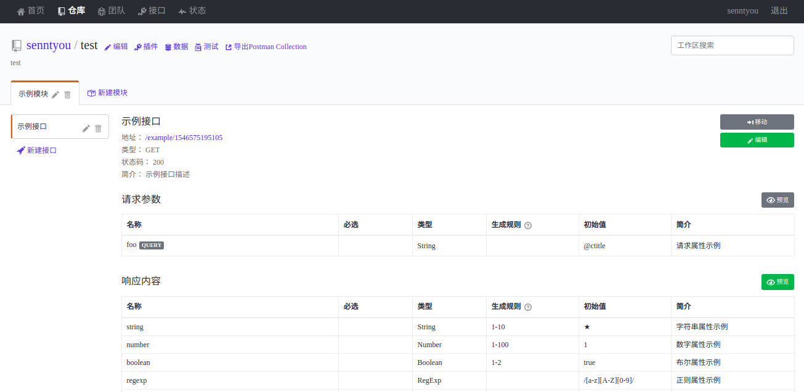

# 前端开发如何做好本地接口模拟

之前有写过一篇 [本地化接口模拟、前后端并行开发](../architecture/2.md)，讲到过本地接口模拟，但不太细致。这次细细的说说本地接口模拟。

## 1. 有什么好处

本地接口模拟最大的好处就是能够使前后端项目解耦，前端更专注于开发，减少线上调试，以此提升开发效率。

## 2. 有哪些途径

本地接口模拟一般分为工具层面和代码层面。

## 3. 工具层面

就工具层面而言，一般是由项目的构建工具提供的功能。比如，当我们用 [webpack-dev-server](https://github.com/webpack/webpack-dev-server)、[browser-sync](https://github.com/BrowserSync/browser-sync) 等工具时，就可以向工具里添加本地接口模拟功能。

> 注：这里不讲解工具如 `webpack-dev-server`、`browser-sync` 等的用法，如有需要，可以自己去了解一下

### 3.1 静态文件

最简单的，我们可以用静态 `json` 文件做本地接口模拟功能。

```
|-- /                        # 项目根目录
    |-- mock/                # 模拟数据目录
        |-- 1.json
        |-- 2.json
        |-- ...
```

然后用 `webpack-dev-server`、`browser-sync` 等工具以项目根目录为基地址来开启本地开发调试，在页面中就可以这样访问：

```
request('/mock/1.json');     // 访问 1.json 
request('/mock/2.json');     // 访问 2.json 
```

### 3.2 注册动态接口

使用静态文件做本地接口模拟功能主要存在以下的一些问题：

1. 静态文件只能以 `get` 方法访问 
2. 输入数据是静态的，不能做运行、循环、判断，不能根据请求参数做不同的响应
3. 本地接口名与服务器不一样，这就比较麻烦了，每次上线到服务器的时候都得改接口名

所以，多数情况下，都会采用注册动态接口的方式做本地接口模拟功能。

这一般又有两种方式：

1. 把本地模拟文件都写在项目内，然后注册动态接口（这也是比较推荐的方式）
2. 把本地模拟文件写在另一个单独项目里，然后使用使用代理的方式，访问模拟接口

#### 3.2.1 把本地模拟文件都写在项目内

```
|-- /                        # 项目根目录
    |-- mock/                # 模拟数据目录
        |-- index.js         # 入口
        |-- user.js
        |-- home.js
        |-- ...
```

`webpack-dev-server` 的相关配置：

```
# webpack.config.js

module.exports = {
  //...
  devServer: {
    before: function(app, server) {
    
      // 在这里读取 mock/index.js 入口文件，载入动态接口
      // 比如下面载入了 `/some/path` 路径 `get` 方法的动态接口： 
      
      app.get('/some/path', function(req, res) {
        res.json({ custom: 'response' });
      });
    }
  }
};
```

`browser-sync` 的相关配置：

```
import browserSync from 'browser-sync';

browserSync.init({
  //...
  middleware: [
    function (req, res, next) {
      
      // 在这里读取 mock/index.js 入口文件，载入动态接口
      // 如果 req 匹配需要载入的动态接口，则直接返回接口相应的数据
      
    },
  ],
});
```

## 4. 线上接口模拟

有些时候，当我们在产品环境的时候（在线上）也可能想用模拟数据（比如微信小程序、用于演示的 web 应用等），或者需要一个地方来统一管理模拟数据时，就需要线上接口模拟了。

比较有名的线上接口模拟工具有：

- [easy-mock](https://github.com/easy-mock/easy-mock)
- [RAP](https://github.com/thx/RAP) / [rap2-delos](https://github.com/thx/rap2-delos) + [rap2-dolores](https://github.com/thx/rap2-dolores)

### 4.1 easy-mock


> 环境需求：Node.js (>= v8.9) & MongoDB (>= v3.4) & Redis（>= v4.0）

### 4.2 rap



> 环境需求：Node.js (>= v8.9) & MySQL (>= v5.7) & Redis（>= v4.0）

RAP 目前有两个版本，第一个版本 [RAP](https://github.com/thx/RAP) 已经被官方废弃了。

RAP2 分成了两个包：

- [rap2-delos](https://github.com/thx/rap2-delos)：服务器端
- [rap2-dolores](https://github.com/thx/rap2-dolores)：web 端

## 5. 代码层面

前端与后端对接的过程中总是难免会遇到一些问题：

- 前端传的参数与后端所需的参数难以保持一致：比如分页，前端定的 `page`、从 1 开始，后端定的 `pageNum`、从 0 开始
- 前端需要的数据与后端返回的数据相差很大，需要对返回的数据做处理


## 后续

更多博客，查看 [https://github.com/senntyou/blogs](https://github.com/senntyou/blogs)

作者：[深予之 (@senntyou)](https://github.com/senntyou)

版权声明：自由转载-非商用-非衍生-保持署名（[创意共享3.0许可证](https://creativecommons.org/licenses/by-nc-nd/3.0/deed.zh)）
