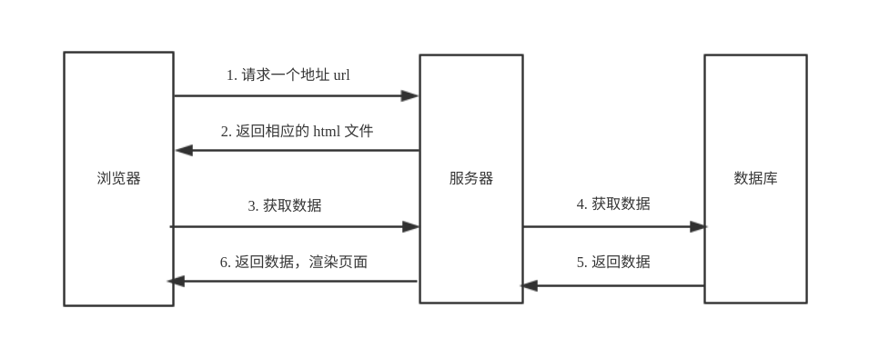
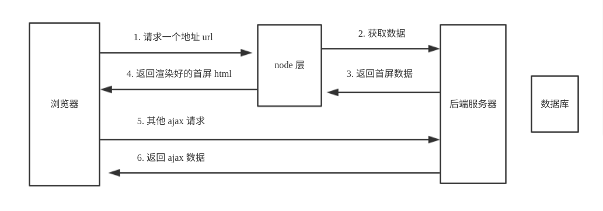

# 细说后端模板渲染、客户端渲染、node 中间层、服务器端渲染（ssr）

前端与后端渲染方式的发展大致经历了这样几个阶段：后端模板渲染、客户端渲染、node 中间层、服务器端渲染（ssr）。

## 1. 后端模板渲染

前端与后端最初的渲染方式是后端模板渲染，就是由后端使用模板引擎渲染好 `html` 后，返回给前端，前端再用 `js` 去操作 `dom` 或者渲染其他动态的部分。

这个过程大致分成以下几个步骤：

1. 前端请求一个地址 `url`
2. 后端接收到这个请求，然后根据请求信息，从数据库或者其他地方获取相应的数据
3. 使用模板引擎（如 `java > jsp`、`php > smarty`）将这些数据渲染成 `html`
4. 将 `html` 文本返回给前端

在这个过程中，前端的 `html` 代码需要嵌入到后端代码中（如 `java`、`php`），并且在很多情况下，前端源代码和后端源代码是在一个工程里的。

所以，不难看出，这种方式的有这样的几个不足：

1. 前后端杂揉在一起，不方便本地开发、本地模拟调试，也不方便自动化测试
2. 前端被约束在后端开发的模式中，不能充分使用前端的构建生态，开发效率低下
3. 项目难以管理和维护，也可能会有前后端职责不清的问题

尽管如此，但因为这种方式是最早出现的方式，并且这种渲染方式有一个好处，就是前端能够快速呈现服务器端渲染好的页面，而不用等客户端渲染，这能够提供很好的用户体验与 SEO 友好，所以当下很多比较早的网站或者需要快速响应的展示性网站仍然是使用这种方式。

## 2. 客户端渲染

随着前端工程化与前后端分离的发展，以及前端组件化技术的出现，如 [react](https://github.com/facebook/react)、[vue](https://github.com/vuejs/vue) 等，客户端渲染已经慢慢变成了主要的开发方式了。

与后端模板渲染刚好相反，客户端渲染的页面渲染都是在客户端进行，后端不负责任何的渲染，只管数据交互。

这个过程大致分成以下几个步骤：

1. 前端请求一个地址 `url`
2. 后端接收到这个请求，然后把相应的 `html` 文件直接返回给前端
3. 前端解析 `js` 后，然后通过 `ajax` 向后台获取相应的数据
4. 然后由 `js` 将这些数据渲染成页面

这样一来，前端与后端将完全解耦，数据使用全 `ajax` 的方式进行交互，如此便可前后端分离了。

其实，不难看出，客户端渲染与前后端分离有很大的好处：

1. 前端独立出来，可以充分使用前端生态的强大功能
2. 更好的管理代码，更有效率的开发、调试、测试
3. 前后端代码解耦之后，能更好的扩展、重构

所以，客户端渲染与前后端分离现在已经是主流的开发方式了。

但这种方式也有一些不足：

1. 首屏加载缓慢，因为要等 `js` 加载完毕后，才能进行渲染
2. SEO 不友好，因为 `html` 中几乎没有可用的信息

## 3. node 中间层

为了解决客户端渲染的不足，便出现了 node 中间层的理念。

传统的 B/S 架构中，是 `浏览器 -> 后端服务器 -> 浏览器`，上文所讲的都是这种架构。

而加入了 node 中间层之后，就变成 `浏览器 -> node -> 后端服务器 -> node -> 浏览器`。

这个过程大致分成以下几个步骤：

1. 前端请求一个地址 `url`
2. node 层接收到这个请求，然后根据请求信息，向后端服务器发起请求，获取数据
3. 后端服务器接收到请求，然后根据请求信息，从数据库或者其他地方获取相应的数据，返回给 node 层
4. node 层根据这些数据渲染好首屏 `html`
5. node 层将 `html` 文本返回给前端

一个典型的 node 中间层应用就是后端提供数据、node 层渲染模板、前端动态渲染。

这个过程中，node 层由前端开发人员掌控，页面中哪些页面在服务器上就渲染好，哪些页面在客户端渲染，由前端开发人员决定。

这样做，达到了以下的目的：

1. 保留后端模板渲染、首屏快速响应、SEO 友好
2. 保留前端后分离、客户端渲染的功能（首屏服务器端渲染、其他客户端渲染）

但这种方式也有一些不足：

1. 增加了一个中间层，应用性能有所降低
2. 增加了架构的复杂度、不稳定性，降低应用的安全性
3. 对开发人员要求高了很多

## 4. 服务器端渲染（ssr）

大部分情况下，服务器端渲染（ssr）与 node 中间层是同一个概念。

服务器端渲染（ssr）一般特指，在上文讲到的 node 中间层基础上，加上前端组件化技术在服务器上的渲染，特别是 [react](https://github.com/facebook/react) 和 [vue](https://github.com/vuejs/vue)。

[react](https://github.com/facebook/react)、[vue](https://github.com/vuejs/vue)、[angular](https://github.com/angular/angular) 等框架的出现，让前端组件化技术深入人心，但在一些需要首屏快速加载与 SEO 友好的页面就陷入了两难的境地了。

因为前端组件化技术天生就是给客户端渲染用的，而在服务器端需要被渲染成 `html` 文本，这确实不是一件很容易的事，所以服务器端渲染（ssr）就是为了解决这个问题。

好在社区一直在不断的探索中，让前端组件化能够在服务器端渲染，比如 [next.js](https://github.com/zeit/next.js)、[nuxt.js](https://github.com/nuxt/nuxt.js)、[razzle](https://github.com/jaredpalmer/razzle)、[react-server](https://github.com/redfin/react-server)、[beidou](https://github.com/alibaba/beidou) 等。

一般这些框架都会有一些目录结构、书写方式、组件集成、项目构建的要求，自定义属性可能不是很强。

以 [next.js](https://github.com/zeit/next.js) 为例，整个应用中是没有 `html` 文件的，所有的响应 `html` 都是 node 动态渲染的，包括里面的元信息、`css, js` 路径等。渲染过程中，`next.js` 会根据路由，将首页所有的组件渲染成 `html`，余下的页面保留原生组件的格式，在客户端渲染。

## 5. 另外

1. 不需要首屏快速加载、SEO 友好的，用全客户端渲染
2. 需要首屏快速加载、SEO 友好的，如果用了如 `react`、`vue` 等组件化技术，将不得不用 node 中间层与服务器端渲染
3. 如果技术团队不支持，不建议在需要首屏快速加载、SEO 友好的地方使用如 `react`、`vue` 等组件化技术
4. 前后端分离之后也可以做后端模板渲染，这样前端的调试可以搭配 [handlebars](https://github.com/wycats/handlebars.js)、[ejs](https://github.com/tj/ejs) 等模板引擎进行本地调试，而后端的调试则需要到测试机了

## 后续

更多博客，查看 [https://github.com/senntyou/blogs](https://github.com/senntyou/blogs)

作者：[深予之 (@senntyou)](https://github.com/senntyou)

版权声明：自由转载-非商用-非衍生-保持署名（[创意共享3.0许可证](https://creativecommons.org/licenses/by-nc-nd/3.0/deed.zh)）
