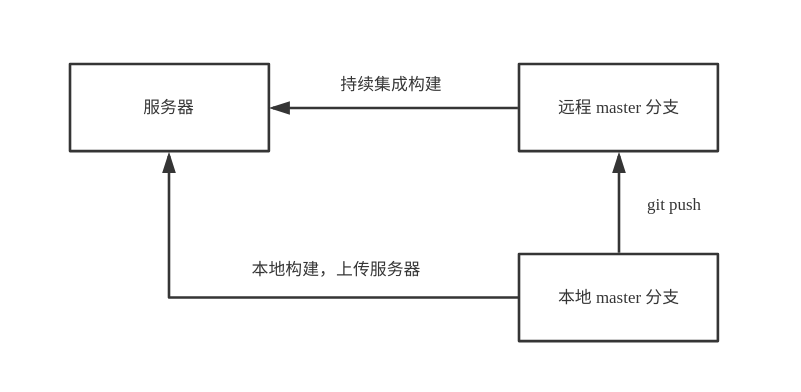
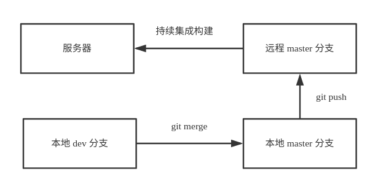
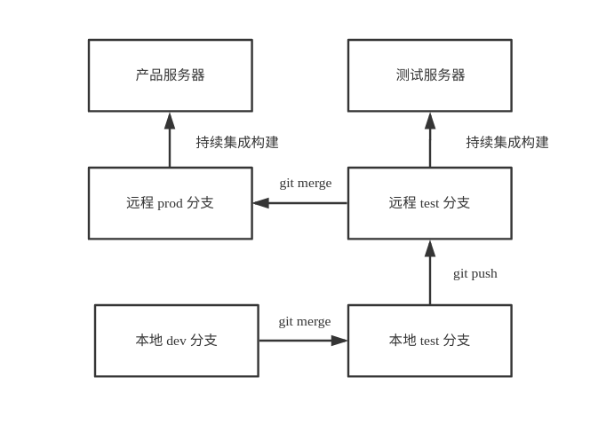
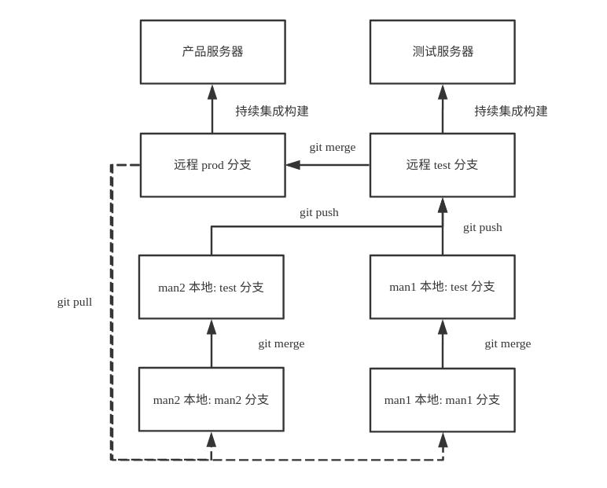
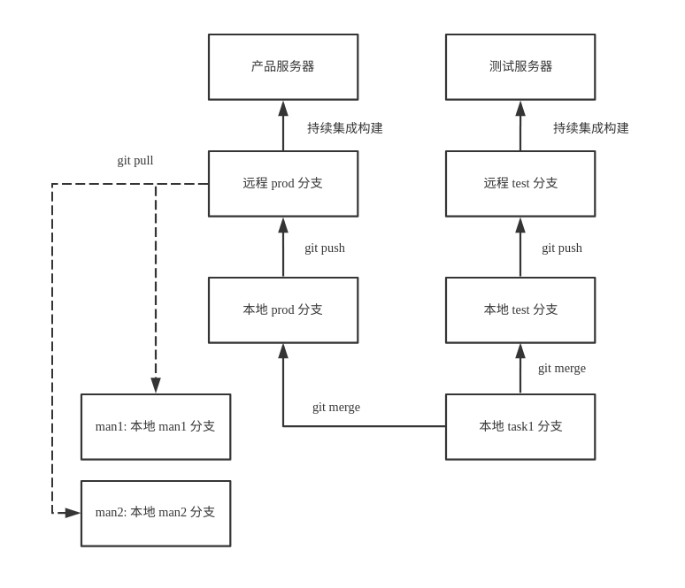
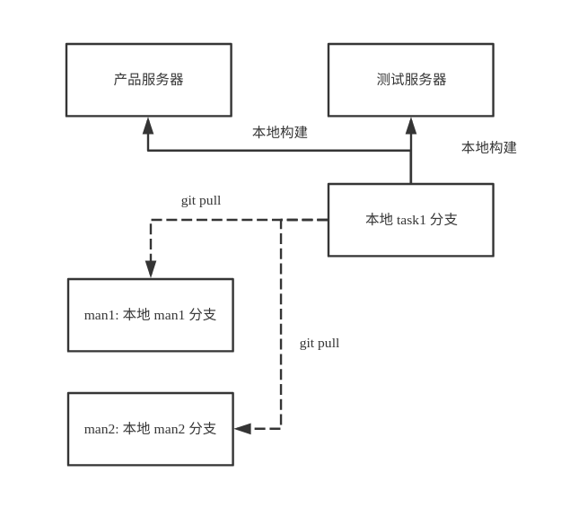

# web 项目如何进行 git 多人协作开发

> 声明：本文不介绍 git 的基本用法，需要读者对 git、git 命令、git 使用有一定的了解

现在，大部分项目都是用 git 来管理代码的，但当项目变大、多人协作时，git 的使用就变得复杂了，这时就需要在 git 使用的流程上来思考如何更优的使用 git。

对于大部分 web 项目而言，并不像软件、APP 项目一样有版本的划分，而是不断的更新、迭代，这就使得 web 项目的 git 使用要复杂一些，需要管理好哪些是正在开发的代码、哪些是提交测试的代码、哪些是已经上线的代码、多人共同开发时如何避免代码冲突与线上新代码被旧代码覆盖等等。

## 1. 一个分支

如果项目比较小，不频繁更新时，可以只用 `master` 一个分支。

使用流程：

1. 提交代码到本地 `master` 分支，并推送到远程 `master` 分支
2. 持续集成构建或本地构建，然后上传到服务器

上传到服务器有两种方式：

1. 持续集成构建，然后同步到服务器
2. 本地构建，然后上传到服务器（为了简洁清晰，后面的图例中会隐藏这种方式）

## 2. 开发分支与个人分支

如果项目稍大些，频繁更新时，就需要另外一个开发分支：

- `master`：主分支，对应线上代码
- `dev`：开发分支，对应开发代码

使用流程：

1. 提交代码到本地 `dev` 分支
2. 在需要构建项目时 `merge` 到本地 `master` 分支，并推送到远程 `master` 分支
3. 持续集成构建，然后同步到服务器

如果是多人参与的项目，就需要个人开发分支了：

- `master`：主分支，对应线上代码
- `man1`：个人 `man1` 开发分支
- `man2`：个人 `man2` 开发分支

使用流程：

1. 提交代码到本地 `man1` 分支（以 `man1` 个人为例）
2. 在需要构建项目时 `merge` 到本地 `master` 分支，并推送到远程 `master` 分支（有可能需要先 `pull` 远程的代码）
3. 持续集成构建，然后同步到服务器

在适当的时候，每一个个人分支（如 `man1, man2`）都需要 `pull` 一下 `master` 分支，以保证自己本地的代码的版本不会低于服务器。

## 3. 多个服务器环境

如果项目比较大，并且对应多个服务器环境（测试环境、产品环境）：

- `master`：主分支
- `prod`：产品分支，对应产品服务器环境
- `test`：测试分支，对应测试服务器环境
- `dev`：开发分支

使用流程：

构建测试环境：

1. 提交代码到本地 `dev` 分支
2. 在需要构建项目时 `merge` 到本地 `test` 分支，并推送到远程 `test` 分支
3. 持续集成构建，然后同步到测试服务器

构建产品环境可以由远程的 `test` 分支 `merge` 到远程 `prod` 分支进行持续集成构建，也可由本地 `dev` 或 `test` 分支 `merge` 到本地 `prod` 分支，并推送到远程 `prod` 分支进行持续集成构建。

如果是多人参与的项目，就需要个人开发分支了：

- `master`：主分支
- `prod`：产品分支，对应产品服务器环境
- `test`：测试分支，对应测试服务器环境
- `man1`：个人 `man1` 开发分支
- `man2`：个人 `man2` 开发分支

使用流程：

构建测试环境：

1. 提交代码到本地 `man1` 分支（以 `man1` 个人为例）
2. 在需要构建项目时 `merge` 到本地 `test` 分支，并推送到远程 `test` 分支（有可能需要先 `pull` 远程的代码）
3. 持续集成构建，然后同步到测试服务器

构建产品环境可以由远程的 `test` 分支 `merge` 到远程 `prod` 分支进行持续集成构建，也可由本地 `man1` 或 `test` 分支 `merge` 到本地 `prod` 分支，并推送到远程 `prod` 分支进行持续集成构建。

在适当的时候，每一个个人分支（如 `man1, man2`）都需要 `pull` 一下 `prod` 分支（如有需要，也可以 `pull` `test` 分支），以保证自己本地的代码的版本不会低于服务器。

## 4. 多个需求同时开发

有时候会有多个需求同时开发，并且相互独立，为了不影响每个需求的测试与上线，需要为每个需求创建一个分支。

- `master`：主分支
- `prod`：产品分支，对应产品服务器环境
- `test`：测试分支，对应测试服务器环境
- `man1`：个人 `man1` 开发分支
- `man2`：个人 `man2` 开发分支
- `task1`：需求 `task1` 开发分支
- `task2`：需求 `task2` 开发分支

使用流程：

构建测试环境与之前的步骤一致，但构建产品环境时，为了保证各个需求不相互影响，一般由本地直接合并到 `prod` 分支：

1. 本地 `task1` 分支 `merge` 到本地 `prod` 分支，并推送到远程 `prod` 分支进行持续集成构建
2. 每一个个人分支（如 `man1, man2`）都需要 `pull` 一下 `prod` 分支，以保证自己本地的代码的版本不会低于服务器
3. 最后删除 `task1` 分支

## 5. 多人协作开发修改公共文件

因为不同分支修改同一个文件而导致的文件冲突是多人协作开发中比较常见的问题之一，避免这种问题的思路主要有以下的几种：

1. 在代码层面，尽量避免多个成员都会改动的文件，尽量将代码分解到每个人只负责自己的那块代码，不需要去改别人的代码
2. 在工程层面，尽量减少公共文件，尽量每个文件只由一个人负责
3. 在 git 层面，如果有必要，可以单独建一个分支，用于更新某些公共文件，并及时的更新到其他分支

## 6. 其他分支

有一些常用的分支，可能我们会用到：

- `bug` 分支：用于紧急修复产品环境的 `bug`

## 7. 根据情况调整、简化流程

上面的图例只有测试服务器和产品服务器，更多服务器类型的工作流程是类似的；图例也只有 `man1` 和 `man2` 两个个人分支，更多个人分支的工作流程也是类似的。

上面的图例主要用于以下特点的项目（需要把整个项目打包成一个整体）：

- 单页面 web 前端应用，整个项目只有一个 html 文件，页面之间的切换由本地路由控制，每次更新到服务器都需要打包所有页面
- Java、Go 等后端应用，每次都需要打包成一个整体，可能是一个文件，或者一批文件（不打包成一个整体的方式除外，比如分散 java class 文件）
- 使用持续集成构建的方式更新代码到服务器

这样做主要是为了避免一些问题：

- 线上新代码被旧代码覆盖：多人同时开发项目，都需要更新到测试机，如果不是统一 `push` 到 `test` 分支做持续集成构建，很难保证线上新代码不会被旧代码覆盖
- 未测试的代码被更新到产品环境：这个问题也需要注意，因为这个问题并不能从流程上完全杜绝，需要各位在开发中留意

对于像下面这种特点的项目，可以根据情况调整、简化流程：

- 多页面 web 前端应用，把某一个页面更新到服务器并不影响其他页面
- NodeJs、PHP、Python 等后端应用，只上传自己更新的文件，而不影响服务器上其他文件（把所有代码打包成一个整体的方式除外）
- 使用本地构建的方式更新代码到服务器

比如：

- `master`：主分支
- `man1`：个人 `man1` 开发分支
- `man2`：个人 `man2` 开发分支
- `task1`：需求 `task1` 开发分支
- `task2`：需求 `task2` 开发分支

使用流程：

如果多个需求没有冲突，可以同时在 `man1` 个人分支上开发，并根据需要上传到不同的服务器。

如果多个需求有冲突，可以每个需求都新建一个分支，如上图所示：

1. 提交代码到本地 `task1` 分支（以 `task1` 个人为例）
2. 根据需要上传到不同的服务器
3. 如果代码通过产品环境后，更新到每个个人分支，并删除 `task1` 分支

这样子，就简单很多了。

## 后续

更多博客，查看 [https://github.com/senntyou/blogs](https://github.com/senntyou/blogs)

作者：[深予之 (@senntyou)](https://github.com/senntyou)

版权声明：自由转载-非商用-非衍生-保持署名（[创意共享3.0许可证](https://creativecommons.org/licenses/by-nc-nd/3.0/deed.zh)）
